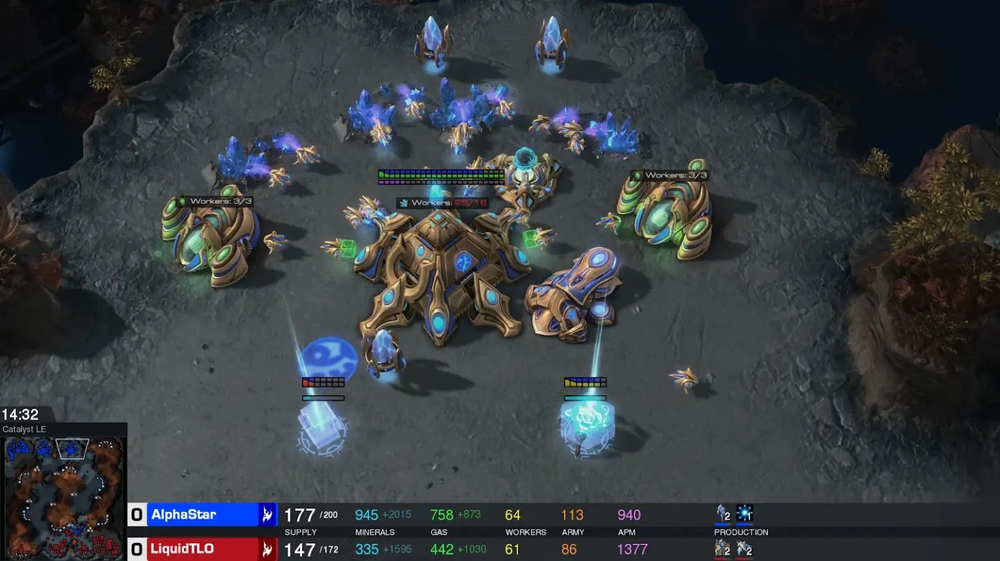
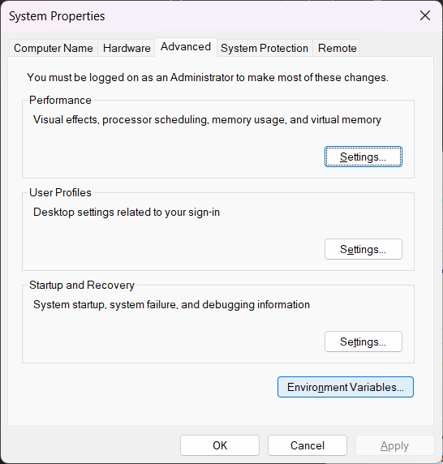
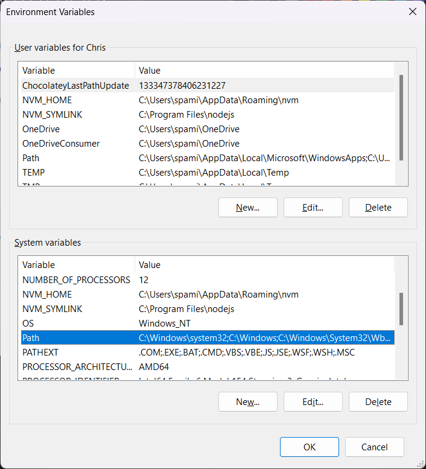
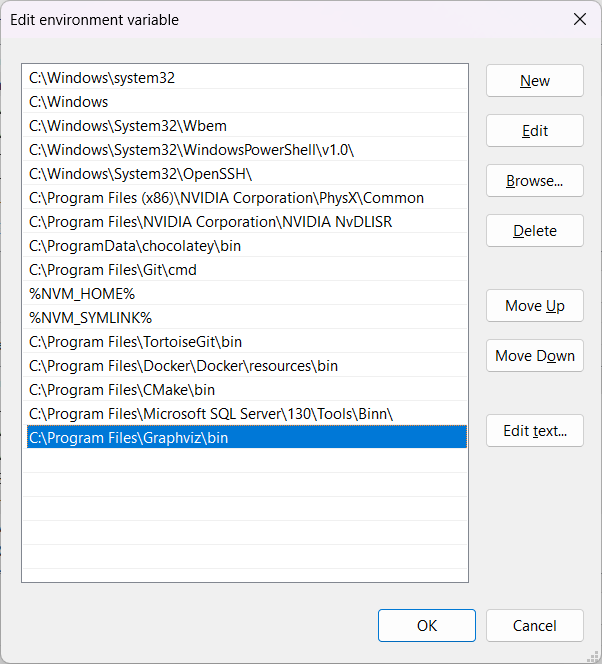

# StarCluster

This project performs clustering on starcraft 2 build orders.

#### 🎮 What is Starcraft 2?

A real time strategy video game. It has a history of being studied in the context of artificial intelligence, see [AlphaStar](https://en.wikipedia.org/wiki/AlphaStar_(software)).



---

#### 🤖 What is Clustering? 

A machine learning technique for labeling data. 

An example of some data points labeled using [K-Means](https://en.wikipedia.org/wiki/K-means_clustering) Clustering:

<p align="center">
  
</p>

---

#### 📦 What's a Build order? 

Much like in the game of chess, where players study openers. See [Chess Opening](https://en.wikipedia.org/wiki/Chess_opening) .

Starcraft Players study build orders, see [Spawning Tool](https://lotv.spawningtool.com/build/). 

In chess an opening might look like this:

`1.e4 c6 2.d4 d5 3.e5 Bf5 4.Bd3 Bxd3 5.Qxd3 e6`

A starcraft build order might look like this:

`Pylon,Gateway,Assimilator,Assimilator,Gateway,CyberneticsCore,Pylon,Stalker,Sentry,Warp Gate,Pylon,Pylon` 

Notice that these build orders/openers can be thought of as a sequence of symbols or words.

Chess players categorise openers into categories. For example: Caro–Kann, Sicilian Defence, Queens Gambit etc.

I want to learn what the openings are in starcraft from professional games. 

StarCluster reads in replay files of professional starcraft 2 games and performs a clustering algorithm on the data set and outputs [dendrograms](https://en.wikipedia.org/wiki/Dendrogram).

---

#### 🏆 Wait, there are professional games? 

Professional tournaments can have large prize pools, the players are highly skilled so the replay files are quite good quality for the purposes of clustering. 

---

#### 🧮 How do you cluster your build orders? 

This Project uses [OPTICS](https://scikit-learn.org/stable/modules/generated/sklearn.cluster.OPTICS.html) clustering. The OPTICS algorithm can cluster any data points as long as you can define a distance metric between them.

This algorithm is unsupervised so you don't need to collect a separate training data set and train the classifier. 

---

#### 📏 How do you define the distance between two starcraft build orders? 

I first tried [Levenshtein](https://en.wikipedia.org/wiki/Levenshtein_distance) distance. 
This is the edit distance (minimum number of insertions, deletions or substitutions). 
For example, consider these two build orders:

`SupplyDepot,Barracks,Refinery,Orbital Command, CommandCenter,BarracksReactor,SupplyDepot,CommandCenter`

`SupplyDepot,Barracks,Refinery,Reaper, Orbital Command,CommandCenter,SupplyDepot,BarracksReactor`

Have edit distance 3. 

I found that the levenshtien distance was too sensitive to slight changes in the order of things. I had better success using [Kullback–Leibler divergence](https://en.wikipedia.org/wiki/Kullback%E2%80%93Leibler_divergence)
and [Jensen–Shannon divergence](https://en.wikipedia.org/wiki/Jensen%E2%80%93Shannon_divergence).

I create a histogram of everything that was built in the opener, then use Kullback–Leibler or Jensen–Shannon divergence to compute the distance between two histograms $P$ and $Q$ . 

Kullback-Leibler:

$$
D_{KL}(P, Q) = \sum_{x} P(x) \log \frac{P(x)}{Q(x)}
$$

Jensen-Shannon:

$$
JSD(P, Q) = \frac{1}{2} D_{KL}(P, M) + \frac{1}{2} D_{KL}(Q, M)
$$

Where 

$$
M = \frac{1}{2}(P + Q)
$$


# Folder Structure

    .
    ├── Data                    # Input replay files, all subfolders will be traversed
    ├── docs                    # Folder for more documentation and background research
    ├── src                     # Source Code
    ├── test                    # Test Cases
    ├── build.orders            # Preprocessed build orders stored here 
    ├── levenshtein             # precomputed levenshtein distances stored here
    ├── venv                    # Convenient location for python virtual environment
    ├── dendrograms             # Output directory, contains clustering diagrams
    └── test.data               # Data associated with test cases


# Replay Files

Additional replay files can be found here

https://lotv.spawningtool.com/replaypacks/


# Dependencies 

[Graphviz](https://graphviz.org/) is used to create clustering diagrams.

You can install it on windows using:

```bash
winget install graphviz
```

To add graphviz to your system path

start -> Environment Variables



System Variables -> Path 



Edit

Add your graphviz path here 



On Ubuntu:

```bash
sudo apt-get install graphviz
```


# Running it

You will need to install [python](https://www.python.org/downloads/)

Check out the repo

```bash
git clone https://github.com/sav-chris/Starcraft-Clustering.git
```

`setup.bat` is the script that creates a virtual environment and installs the dependencies.
On windows you can run this, if you are on linux run `setup.sh`

If you have already run this, you just need to activate the virtual environment

on windows

```bash
.\venv\Scripts\activate
```

on linux

```bash
source venv/bin/activate
```

You will need to get some replay files such as the ones available on [spawning tool](https://lotv.spawningtool.com/replaypacks/)

Unzip them into the `Data` folder. They may be in subfolders as all subfolders will be searched.

To run the whole thing:

Go to src folder
```bash
cd src
```

```bash
python clustering.py
```

# Running test cases

Once you have created and activated your virtual environment, you can run the test cases.

Go to test folder
```bash
cd test
```

Each test file is run individually, ie:
```bash
python ClusteringController.test.py
python LabelEncoder.test.py
python Player.test.py
python RaceBuildOrder.test.py
```

# Dendrograms 

The program output is stored in the `Dendrograms` folder.

Each run is stored in a new subfolder and the `Hyperparameters.json` file records the selected hyperparameters used for that run.

The files `Race.Protoss.Uncategorised.txt`,  `Race.Terran.Uncategorised.txt` and `Race.Zerg.Uncategorised.txt` record the number of build orders that were not assigned to a cluster for their respective races.   

The dendrogram images will be stored in [svg](https://en.wikipedia.org/wiki/Scalable_Vector_Graphics) files and look like this:


